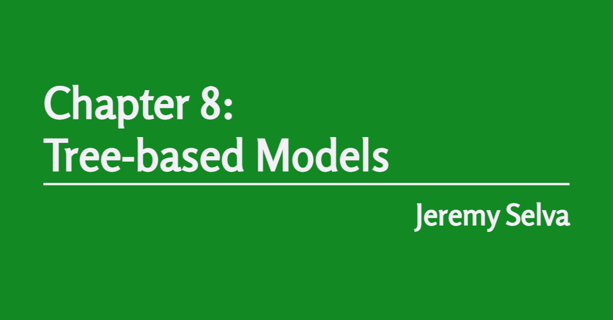

---
output:
  md_document:
    variant: gfm
---

```{r, include = FALSE}
knitr::opts_chunk$set(
  collapse = TRUE,
  comment = "#>",
  fig.align = 'center'
)
```

# ISLR2 Chapter 8 slides for R4DS book club cohort 3

An Introduction to Statistical Learning: With Applications in R Second Edition Chapter 8 slides for R for Data Science book club cohort 3.  

Here are the source code for my [slides](https://jauntyjjs.github.io/islr2-bookclub-cohort3-chapter8)


