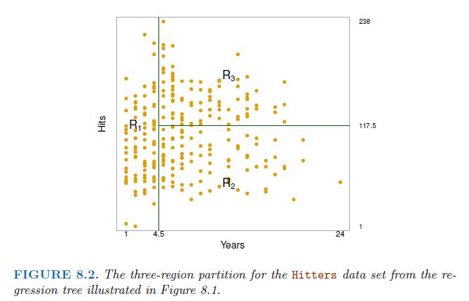
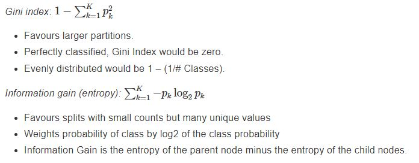
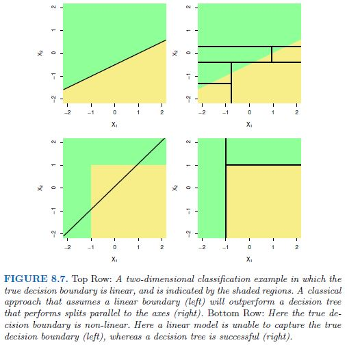
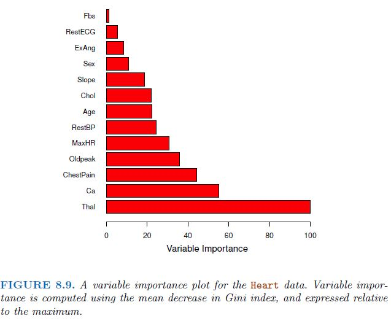
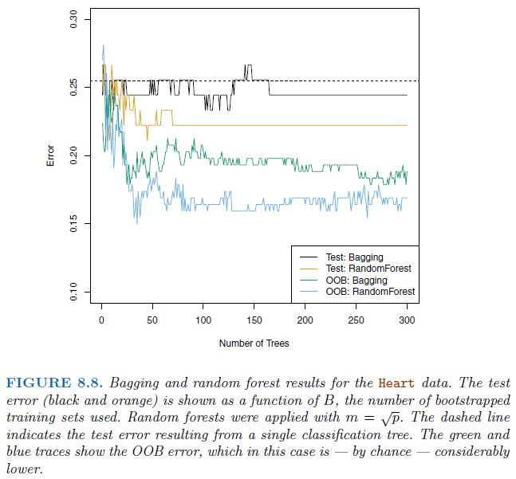

```{r initial, echo = FALSE, cache = FALSE, results = 'hide'}
library(knitr)
library(glue)

options(htmltools.dir.version = FALSE, tibble.width = 60, tibble.print_min = 6)
opts_chunk$set(
  echo = FALSE, 
  warning = FALSE, 
  message = FALSE, 
  comment = "#>",
  #fig.path = 'figure/', 
  cache.path = 'cache/',
  dpi = 300, 
  fig.align = 'center', 
  #fig.width = 6,
  #ig.asp = 0.618,
  #fig.show = 'hold',
  cache = TRUE
  #dev = 'svglite'
)
```

# Introduction

This chapter introduces tree-based methods for regression and classification

- Decision Trees
- Bagging
- Random Forest
- Boosting
- Bayesian Additive Regression Trees 

---

# 8.1.1 Regression Trees

1. Divide the predictor space — that is, the set of possible values
for $X_1,X_2, . . . ,X_p$ — into $J$ distinct and .red[**non-overlapping**] regions,
$R_1,R_2, . . . ,R_J$ .

2. For every observation that falls into the region $R_j$, where $1 \le j\le J$, take the .red[**mean**] of the response values for the training observations in $R_j$.

```{r echo = FALSE, out.width="60%"}

```

---

# 8.1.1 Regression Trees

The goal is to find boxes $R_1, . . . ,R_J$ that minimize the $RSS$, given by


$$\mathrm{RSS}=\sum_{j=1}^{J}\sum_{i{\in}R_j}^{}(y_i - \hat{y}_{R_j})^2$$

where $\hat{y}_{R_j}$ is the mean response for the training observations within the $j$th box.

Unfortunately, it is .red[**computationally infeasible**] to consider every
possible partition of the feature space into $J$ boxes.

---

# 8.1.1 Regression Trees

One way is given all predictors $X_1,X_2, . . . ,X_p$, find the best cut off point $s$ for a given predictor $X_k$, where $1 \le k\le p$ such that the resulting two regions

.center[
$R_1(k,s)=\left\{X|X_k<s\right\}$ and $R_2(k,s)=\left\{X|X_k{\ge}s\right\}$
]

have the least $RSS$ for all predictors

$$RSS=\sum_{i:x_i{\in}R_1(k,s)}(y_i-\hat{y}_{R_1})^2 +  \sum_{i:x_i{\in}R_2(k,s)}(y_i-\hat{y}_{R_2})^2$$
where $\hat{y}_{R_1}$ is the mean response for the training observations in $R_1(k,s)$, and $\hat{y}_{R_2}$ is the mean response for the training observations in $R_2(k,s)$.

See https://bookdown.org/tpinto_home/Beyond-Additivity/regression-and-classification-trees.html for animation.

Repeat the process until no region contains more than five observations. However, this will results in an overfitting tree.

---

# 8.1.1 Regression Trees

A better strategy is to 

1. grow a very large tree $T_0$ as before 
2. tune $\alpha$ in the cost complexity pruning formula to prune/penalise $T_0$ to give a sequence of sub trees. 
3. apply cross validation or validation set on those sub trees and pick $\alpha$ that gives the best sub tree (smallest $RSS$).

The cost complexity pruning formula is 

$$\sum_{m=1}^{|T|}\sum_{x_i{\in}R_m}(y_i-\hat{y}_{R_m})^2 + \alpha|T|$$
where $\alpha\ge0$, $|T|$ is the number of terminal nodes the sub tree $T$ holds. $R_m$ is the box/region corresponding to the $m$th terminal node and $y_i-\hat{y}_{R_m}$ is the mean response for the traning observation in $R_m$

---

# 8.1.1 Regression Trees

$$\sum_{m=1}^{|T|}\sum_{x_i{\in}R_m}(y_i-\hat{y}_{R_m})^2 + \alpha|T|$$

When $\alpha = 0$, the sub tree $=T_0$ as the cost complexity pruning formula equals to the $RSS$.

Similar to lasso, as $\alpha$ increase, some terminal nodes will not be used.

See https://www.youtube.com/watch?v=D0efHEJsfHo for animation.

---

# 8.1.2 Classification Trees

In the case of classification, instead of taking the mean of a given region, we take the most commonly occurring class (or mode) of training observations in the region to which it belongs.

For the measurement of error, instead of $RSS$, one way is to use the fraction of the training observations in that region that do not belong to the most common class.

$$E = 1 - \max_k(\hat{p}_{mk})$$
where $\hat{p}_{mk}$ the proportion of training observations in the $m$th region that are from the $k$th class. Hence, $0\le\hat{p}_{mk}\le1$

However, this error rate is unsuited for tree-based classification.

---

# 8.1.2 Classification Trees

Instead, the Gini index or the entropy. Both are very similar measures, where small values indicate that the node contains large number of observations from a single class.

The Gini index is defined by

$$G = \sum_{k=1}^{K}\hat{p}_{mk}(1-\hat{p}_{mk})$$
The entropy is defined by

$$D = - \sum_{k=1}^{K}\hat{p}_{mk}\log(\hat{p}_{mk})$$

Both Gini index and Entropy are small when all of the $\hat{p}_{mk}$'s are close to zero or one.

When building the classification tree, these classification error measurements can be used to evaluate the sub trees.

---

# 8.1.2 Classification Trees

See https://bookdown.org/tpinto_home/Beyond-Additivity/regression-and-classification-trees.html

```{r echo = FALSE}

```

---

# 8.1.3 Trees Versus Linear Models

In terms of prediction accuracy, ... it depends

```{r echo = FALSE, out.width="50%"}

```

---

# 8.1.3 Trees Versus Linear Models

Compared to linear models, decision trees are easier to explain to others because they mirror human decision-making. They can be displayed graphically and easily interpreted by non-experts.

However, it is less robust than the linear models. A small change in the data set can cause a large change to the decision tree. This may hurt the decision trees performance in prediction.

To improve its performance, methods like bagging, random forests, and boosting are used (sometimes at the cost of interpretability). 

---

# 8.2.1 Bagging

Bagging is an approach that tries to “stabilise”(make it more robust to change of data) the predictions from trees

The idea is to generate $B$ different bootstrapped training datasets to create $B$ different regression trees $\hat{f}^{*b}$ respectively for $1\le b \le B$. Given a new observation to predict called $x$, we use the $B$ regression trees to create $B$ predictions. The final prediction value is calculated by averaging all the predictions.

$$\hat{f}_{bag}(x) = \frac{1}{B}\sum_{b=1}^B\hat{f}^{*b}(x)$$

In the case of classification, we record the class predicted by each of the $B$ trees, and take a majority vote.

What is missing is how do we estimate the test error rate (without using the test data) to pick the best $B$ value or number of bagged trees ?

---

# 8.2.1 Bagging

Each bagged tree is trained using two-thirds of the training data. The other one-third of the training data, known as out-of-bag or $OOB$ observations are then used.

Given an $OOB$ observation, we first predict its response using only bagged trees that do not use this $OOB$ observation in its training. An $OOB$ prediction is made by averaging the predicted response (regression) or a majority vote (classification) among these specific bagged trees. 

As each $OOB$ observation has an $OOB$ prediction and a true response, the $OOB$ error can be computed via the overall $OOB$ $RSS$ (regression) or classification error like Gini index. The $B$ value that gives the least $OOB$ error will be taken.

---

# 8.2.1 Bagging

.pull-left[
Bagging usually improves prediction accuracy at the expense of interpretability. 

It is no longer clear which predictors are more important as we now have more than one tree (which may gives differing views on the importance of a given predictor).

An overall summary of the importance of each predictor can be achieved by recording how much the average $RSS$ or Gini index improves (or decreases) when each tree is splitted over a given predictor.
]

.pull-right[
```{r echo = FALSE, out.width="110%"}

```
]


---

# 8.2.2 Random Forests

One problem with bagging is that each bagged tree may be highly similar to one another. 

This happen if there is a strong predictor in the data set. Then in the collection of bagged trees, most or all of the trees will use this strong predictor in the top split, regardless of changes in the training set led by bootstrapping. This may cause the tree model to be less robust to changes in the data over time.

To improve the robustness further, a change is made during the creation of a split in a given bagged tree on bootstrapped training samples. 

Instead of using the full set of $p$ predictors as split candidates, only a random sample of $m \approx \sqrt{p}$ predictors are used instead.

This reduces the odds of the strong predictor being selected during the split and provide other predictors a chance.

---

# 8.2.2 Random Forests

```{r echo = FALSE, out.width="50%"}

```


---

# 8.2.3 Boosting
